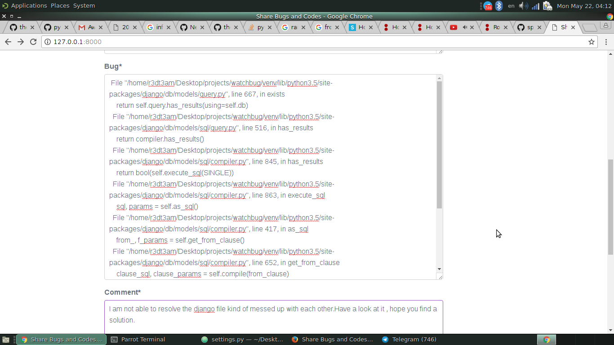
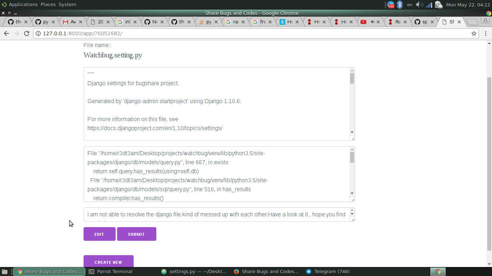
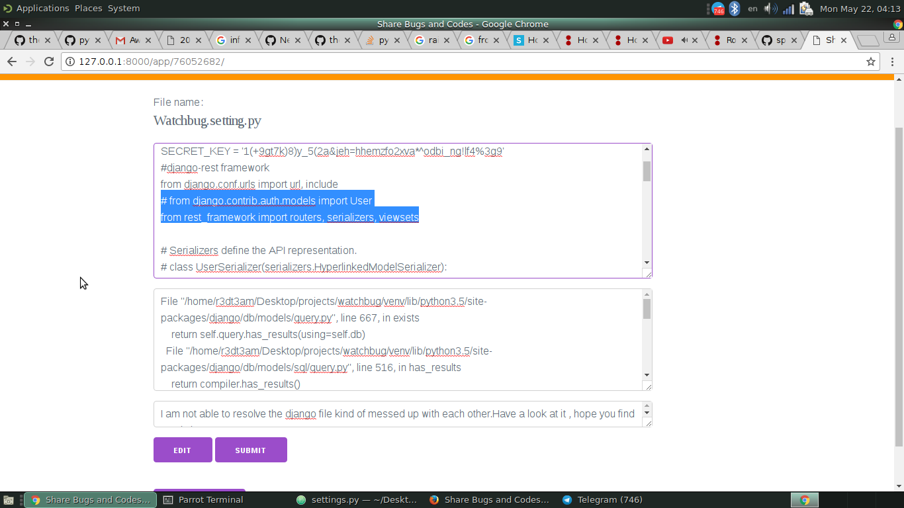

# Introduction

**Watch bug** is a code and bug sharing platform , where one can share, what is the bug he is facing on working with
corresponding code ete. The project focuses that other end-user is properly able to understand the code and bug.

One can fill all the fields then after submit he/she gets a unique id with the help of it he/she can share his post to anyone.

*All these things in a very instant time.*


# Motivation to make the project

While learning Django and solving competitive programming questions,many time I used to stuck at some place and
i really need the *instant help* from my friends to solve and debug the code . So for that Instant help and the
*small code* one should not use the big platforms like **stackoverflow** for asking stupid questions.There were other means like
pastebin but these do not provide the differentiate between the code, bug and comment feature.

With this platform i was able to send bug that came in the terminal, along with the code , also write about what I did ,
where should he look into, what methodology did i used to solve it by describing  in comment section.


## Key Features:-

1. **Django REST FRAMEWORK**
2. **CRUD (CREATE , VIEW , UPDATE , DELETE)**
3. **Unique ID with each paste**

## To deploy on local system

1. Clone the repository    
```https://github.com/theparadoxer02/WatchBugs/```    
2. Create a Python Virtual Environment    
    ```virtualenv -p python3 venv for python3```    
    ```virtualenv venv for python 2.7```    
    *(I hope that python 2.7 is default installed on the ubuntu system)*    
    
3. Install the requirements file    
    ```cd WatchBugs```    
    ```pip install -r requirements.txt``` 
    
4.  Migrate and run the server 
      ```python manage.py makemigrations```    
      ```python manage migrate```    
      ```python manage.py runserver```  
      
5. Visit the URL    
```http://127.0.0.1:8000```
  

# Some of the preview

### Pasting code (Create)

### After the unique Paste Id is generated (View)

### Edit Phase (UPDATE)


